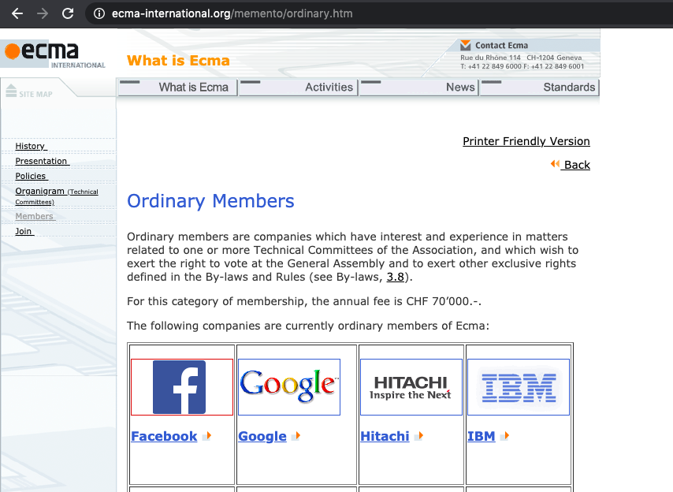

# material-umd

> UMD дистрибутив ui тулкита [material-ui](https://github.com/mui-org/material-ui), поставляемый вместе с файлом описания типов typescript с пространствами имен глобального объекта

*Описание, при чем тут Роскомнадзор ниже по тексту*

## Ссылки

 - [Демо-проект, использующий umd дистрибутив](packages/documentation-site/README.md)
 - [Генерация type definition для umd на основе вложенности](packages/how-it-is-made/README.md)

## Брифинг

Начиная с версии 16.8 в React доступен хук [useReducer](https://reactjs.org/docs/hooks-reference.html#usereducer), реализующий паттерн [state reducer pattern](https://redux.js.org/). Как следствие, библиотека все больше начинает походить на полноценный фреймворк со своей методологией программирования. Отличительной особенностью так и остается миниатюрность: [легко интегрировать в другие решения](reactjs.org/docs/web-components.html#using-react-in-your-web-components), простейший к пониманию и легкий к отладке код прикладного программиста.

Однако, существующие системы сборки проектов назвать миниатюрными никак нельзя. Вследствие их основанности на конвейере микро-утилит, каждая из которых имеет зависимости на обособленных интернет-ресурсах, велик риск их не разрешения: проект фантомно перестает собираться. Например, такое произошло со студенческими проектами после [удаления бинарных дистрибутивов](https://github.com/sass/node-sass/issues/1911) старых версий node-sass.

Для фриланса, мне нужно сочетать простоту и миниатюрность как на этапе исполнения, так и во время сборки. Если я буду тратить все свое время на мониторинг зависимостей, мне некогда будет заниматься разработкой. [Ветка v0.x](https://github.com/DefinitelyTyped/DefinitelyTyped/blob/3afd612b194cea216abf07f91b3470b33c34cb79/types/material-ui/index.d.ts) ui тулкита material-ui позволяла вместо каскада утилит ограничить множество зависимостей на одном TypeScript Compiler используя [Namespaces](https://www.typescriptlang.org/docs/handbook/namespaces-and-modules.html#using-namespaces). Однако, с последующими выпусками разработчики перешли на ES6 модули для типизации. Это оправдано, если есть несколько программистов, в том числе Dev Ops. Для одного разработчика приемлемость такого решения спорна.

## А при чем тут роскомнадзор?

Оно бы все ничего, но те самые удаленные ресурсы, от которых зависит сборка проекта, размещаются на тех же облачных сервисах, что и зеркала Telegram. В итоге, неосознанно, Роскомнадзор осуществляет геноцид малого бизнеса по сайтостроению путем принесения времени разработчиков в жертву сатане: каждый тратит время на поиск рабочего vpn и за год пару жизней трудочасами набегает (шутка). Однако, у этого есть весомый плюс:

## Глубокая интеграция сервисов Google в "свободном" интернете

Сам [TypeScript Compiler](https://github.com/microsoft/TypeScript/blob/master/src/compiler/core.ts) написан на namespace и не имеет сторонних зависимостей. Заявления об их устаревании демонстрируют полное непонимание, что отсутствие стандартного местоположения модулей в спецификации ES6 насаждает подгрузку зависимостей с удаленных серверов. В сочетании с deno, где модули подгружаются по url в наглую, не нужно объяснять, что за банкет платят крупнейшие продавцы пользовательских данных. Особо примечательна купленность как автора NodeJS, так и всей группы TC39 в отношении к Deno. Включение ссылок на удаленные интернет-ресурсы является вектором развития спецификации.

В будущем, преимущество deno над NodeJS с сохранением текущего вектора развития очевидно. Однако, лучше чтобы это будущее не наступало чуточку подольше и этому отлично способствует финансовая невыгодность временных затрат на починку разрешения удаленных зависимостей.

## В каждой шутке - доля шутки

Рекурсия

 
